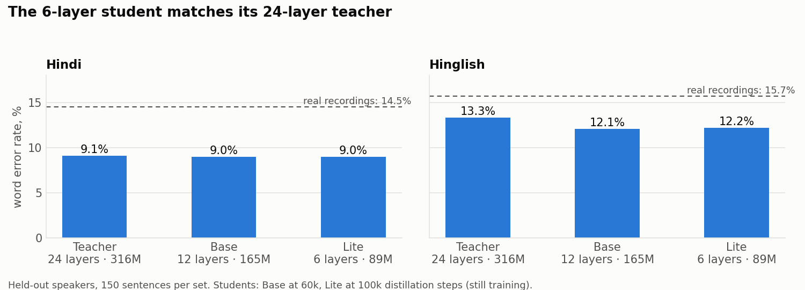
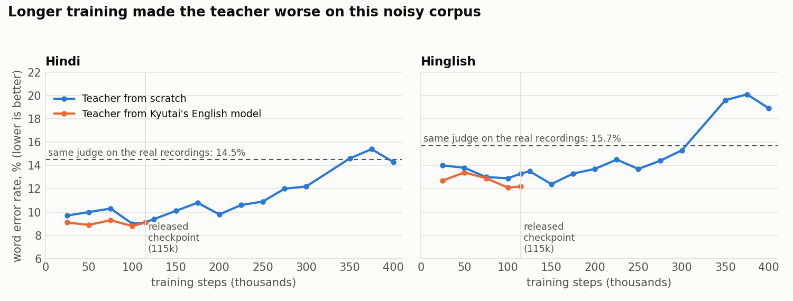
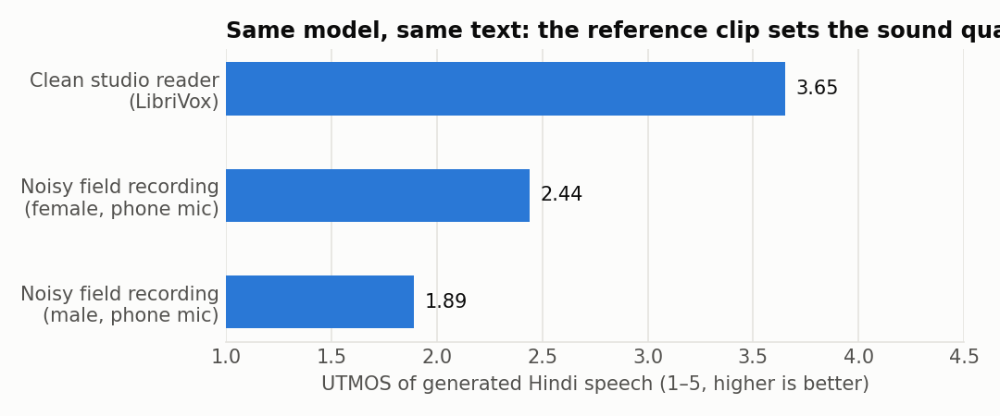
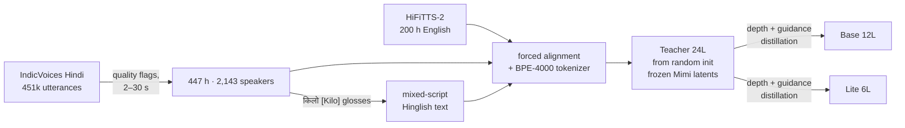

# Jugnu Pocket TTS

**Small text-to-speech models for Hindi, English and Hinglish, with voice cloning — trained in the open, mistakes included.**

**[▶ Listen to samples](https://altslate-labs.github.io/jugnu-pocket-tts/)** · **[Weights on Hugging Face](https://huggingface.co/altslate/jugnu-pocket-tts)** · [Experiment log](notes/experiments.md) · [Decisions](notes/decisions.md) · [Roadmap](notes/roadmap.md)

A family of three models that read Devanagari, Latin, or both in one sentence —
`कल की meeting तीन बजे है, और updated link मैंने भेज दिया है` — in a voice cloned from a few seconds of reference audio.
Built by [altslate labs](https://huggingface.co/altslate) on [Kyutai's Pocket TTS / CALM recipe](https://github.com/kyutai-labs/pocket-tts).
This is a community-trained model and **not an official Kyutai release**.

| Model | Layers | Parameters | For |
| --- | --- | --- | --- |
| Teacher | 24 | 316 M | Research and distillation. Needs guidance 2.0 (use the eval code here). |
| Base | 12 | 165 M | Distilled student, guidance baked in. Standard `pocket-tts` runtime. |
| Lite | 6 | 89 M | Distilled student for CPUs and small devices. |

## Results

Benchmark: 20 held-out speakers never seen in training; the voice prompt is 5 s of a *different* utterance by the
same speaker; 150 Hindi + 150 Hinglish sentences; word error rate from IndicConformer-600M.

*The students match the teacher. The dashed line is the same ASR judge on the real recordings of these sentences —
our clean synthetic speech is easier for it than noisy field audio, so read 9–14% as "at the judge's floor".*

| Model | Hindi WER / CER | Hinglish WER / CER | Speaker similarity |
| --- | --- | --- | --- |
| Teacher 24L (115k steps, cfg 2.0) | 9.1% / 3.3% | 13.3% / 6.7% | 0.91 |
| Base 12L (60k distillation steps, still training) | 9.0% / 3.2% | 12.1% / 5.5% | 0.91 |
| Lite 6L (100k distillation steps, still training) | 9.0% / 3.2% | 12.2% / 5.2% | 0.91 |

**Not yet measured:** English WER, cross-language cloning at scale, long text / names / numbers, latency and CPU
real-time factor, and any human listening test. Every number here comes from an automatic judge.

### Two things we learned the hard way

*Upstream's advice is to never shorten the 400k-step schedule. On our corpus — two-thirds 16 kHz field recordings —
the teacher was best around 100–150k steps; training on cost 5–6 WER points and bought nothing. We release the 115k
checkpoint. Starting from Kyutai's English model (orange) helped only slightly.*

*A cloning model copies its prompt's acoustics. Our benchmark prompts are phone recordings that themselves score
UTMOS 2.0, which capped our "naturalness" number for days. With a clean reference the same checkpoint reaches 3.65
on Hindi. **Use a clean reference clip.***

The third lesson is in the [experiment log](notes/experiments.md): our first two training runs learned nothing
for 63k steps because the ungated Kyutai weights ship a zeroed codec encoder (that is how voice cloning is
withheld) while the loss curve looked perfectly healthy. `training/check_codec.py` now gates every launch.

## How it was built

- **Data (647 h).** 447 h of Hindi from [IndicVoices](https://huggingface.co/datasets/ai4bharat/IndicVoices), keeping
  only utterances rated "excellent" with none of the dataset's 17 problem flags, plus a 200 h subset of
  [HiFiTTS-2](https://huggingface.co/datasets/nvidia/hifitts-2). 20 + 20 speakers held out.
- **Hinglish without a Hinglish corpus.** IndicVoices transcripts mark code-switched words as `किलो [Kilo]`; for half
  of those utterances we train on the Latin spelling (35% of utterances carry such marks). Word-level switching only.
- **Teacher.** Kyutai's `scratch.yaml` unchanged: 24-layer FlowLM from random initialisation on frozen Mimi latents,
  LSD objective, lr 2e-4, effective batch 64, conditioning dropout 0.2.
- **Students.** Kyutai's `depth_distill.yaml`: the student keeps the teacher's head and its bottom + top layers and
  learns to match the teacher's backbone output with guidance 2.0 baked in.
- **Hardware.** 2 × RTX PRO 4500 Blackwell (32 GB) per run, ~3 steps/s.

## Run it

Weights and instructions are on [Hugging Face](https://huggingface.co/altslate/jugnu-pocket-tts). Kyutai's codec is
not redistributed: `release/assemble.py` fetches it with your own account after you accept
[their terms](https://huggingface.co/kyutai/pocket-tts).

## Reproduce it

Everything here runs inside a checkout of `kyutai-labs/pocket-tts` pinned at `d9206671`.

| Folder | What |
| --- | --- |
| `training/` | data extraction + filtering, speaker-disjoint splits, Hinglish swap, codec gate, launch + supervisor scripts |
| `configs/` | teacher (scratch and from-English) and the two distillation configs |
| `eval/` | held-out Hindi/Hinglish benchmark, IndicConformer scoring, demo generation, checkpoint watchers |
| `release/` | FlowLM-only export, `assemble.py`, model card |
| `notes/` | the plan, every decision with its reason, the full experiment log, the roadmap |
| `docs/` | the demo page |

## Limitations

Hindi audio is band-limited (16 kHz sources) and Kyutai's codec loses more detail on our Hindi than on English (24%
vs 1% ASR drift after encode→decode). No child speech, no Indian-accented English, little expressive speech in
training. Hinglish is 3–4 WER points harder than Hindi. Rare words and some English loanwords get mangled
(`reschedule` is a reliable failure). Romanized Hindi is not supported; write numbers as words.

## Responsible use

These models can imitate a voice from a short recording. Clone a voice only with the speaker's **explicit, lawful
consent**. No impersonation, fraud, or passing generated audio off as a real recording. The weights carry the same
prohibited-use terms as Kyutai's. Every sample we publish uses public-domain LibriVox reader voices only.

## Roadmap

Next: our own codec trained on Indian speech, 48 kHz Hindi data, recorded clause-level Hinglish and Indian English,
consented studio voices, and the missing benchmarks. Details in [notes/roadmap.md](notes/roadmap.md).

## Acknowledgements

[Kyutai](https://kyutai.org) for Pocket TTS, Mimi, the CALM recipe and open training code ·
[AI4Bharat](https://ai4bharat.iitm.ac.in) for IndicVoices and IndicConformer · NVIDIA and the LibriVox volunteers
for HiFiTTS-2 · Harveen Chadha / Vakyansh for the Hindi aligner · Singh, Singh & Kadyan for HiACC · OpenAI Whisper,
Microsoft WavLM and UTMOS for evaluation. Full list with licenses in [NOTICE.md](NOTICE.md).

## License

Code: MIT. Weights: CC BY 4.0 with use terms (on Hugging Face). Please credit "Jugnu Pocket TTS, altslate labs".
